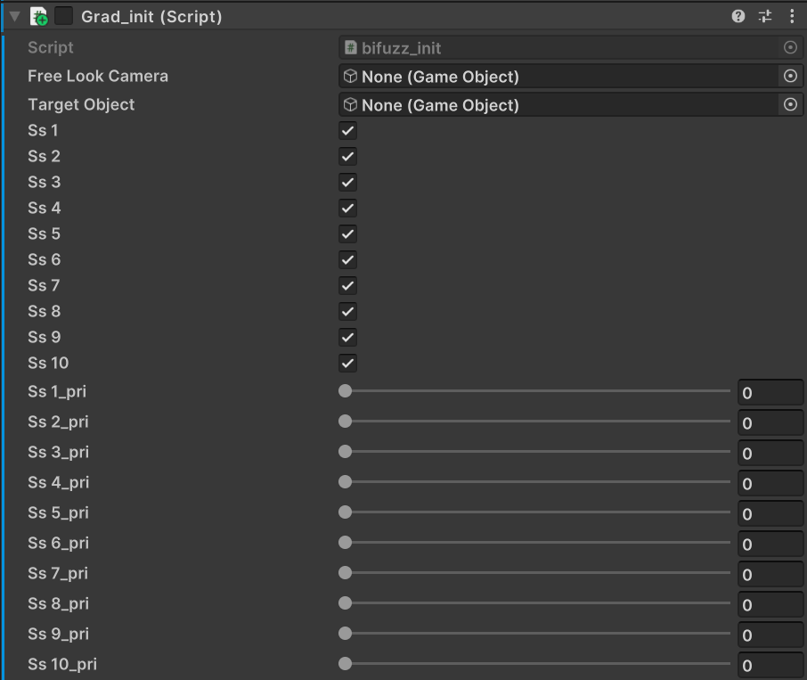
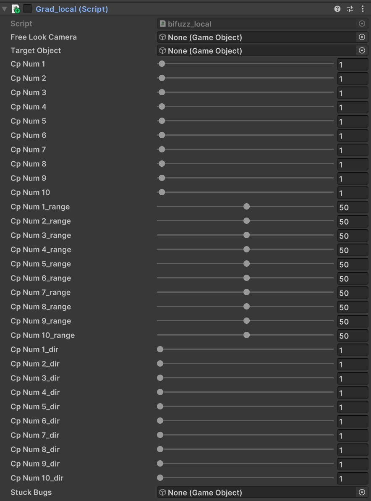

# Video

# Requirements
## IDE
Unity 2022.3.12f1
## Assets
- [Dog Knight PBR Polyart](https://assetstore.unity.com/packages/3d/characters/animals/dog-knight-pbr-polyart-135227)
- [Fantasy Worlds: Forest FREE - Stylized Forest Environment Open World](https://assetstore.unity.com/packages/3d/environments/fantasy/fantasy-worlds-forest-free-stylized-forest-environment-open-worl-282610)
- [AllSky Free - 10 Sky / Skybox Set](https://assetstore.unity.com/packages/2d/textures-materials/sky/allsky-free-10-sky-skybox-set-146014)
- [Fantasy Forest Environment - Free Demo](https://assetstore.unity.com/packages/3d/environments/fantasy/fantasy-forest-environment-free-demo-35361)
- [Simple Gems and Items Ultimate Animated Customizable Pack](https://assetstore.unity.com/packages/3d/props/simple-gems-and-items-ultimate-animated-customizable-pack-73764) (The latest version is unapplicable, so the old version is included in this repository.)

# How to Use
1. 'Play_Style_A' and 'Play_Style_B' are independent Unity projects. Add and open each of them to the Unity Hub project.
2. Import all assets and run '_URP Content - Fantasy Worlds - Old Forest DEMO.unitypackage' from Assets\TriForge Assets.
3. Open the 'Prospect' scene in Assets/Scenes.
4. Replace the terrain layer with 'layer_grass01_bb3407d0e55802f81.terrainlayer'.
5. Use the Render Pipeline Converter to convert your materials to URP.
6. Attach all the scripts in Assets/BiFuzz to 'DogPolyart'.
7. When you attach a script, it becomes a component. In the added component, uncheck 'Grad_init' and 'Grad_local' to disable them.
8. Set the 'Grad_init' and 'Grad_local' components of 'DogPolyart' as shown in the image below. Even if there is no change from initial values, be sure to move sliders and re-enter the values.
    
    
9. Assign the number of frames the test will run to the variable exeTime in Assets/BiFuzz/ExeTime.cs.
10. Empty Assets/Logs and run the scene. Test results will be saved as a CSV file in Assets/Logs.

# Directory Structure
<pre>
BiFuzz  
├── Play_Style_A  
│   └── Assets  
│       ├── BiFuzz  
│       └── Logs  
└── Play_Style_B  
    └── Assets  
        ├── BiFuzz  
        └── Logs  
</pre>

In this repository, we provide separate Unity projects corresponding to Play styles A and B, as used in the evaluation experiments presented in our paper. Each play style has its own directory, which includes the 'Assets' directory containing the 'BiFuzz' directory (where the scripts that make up BiFuzz are stored) and the 'Logs' directory that contains the execution results.